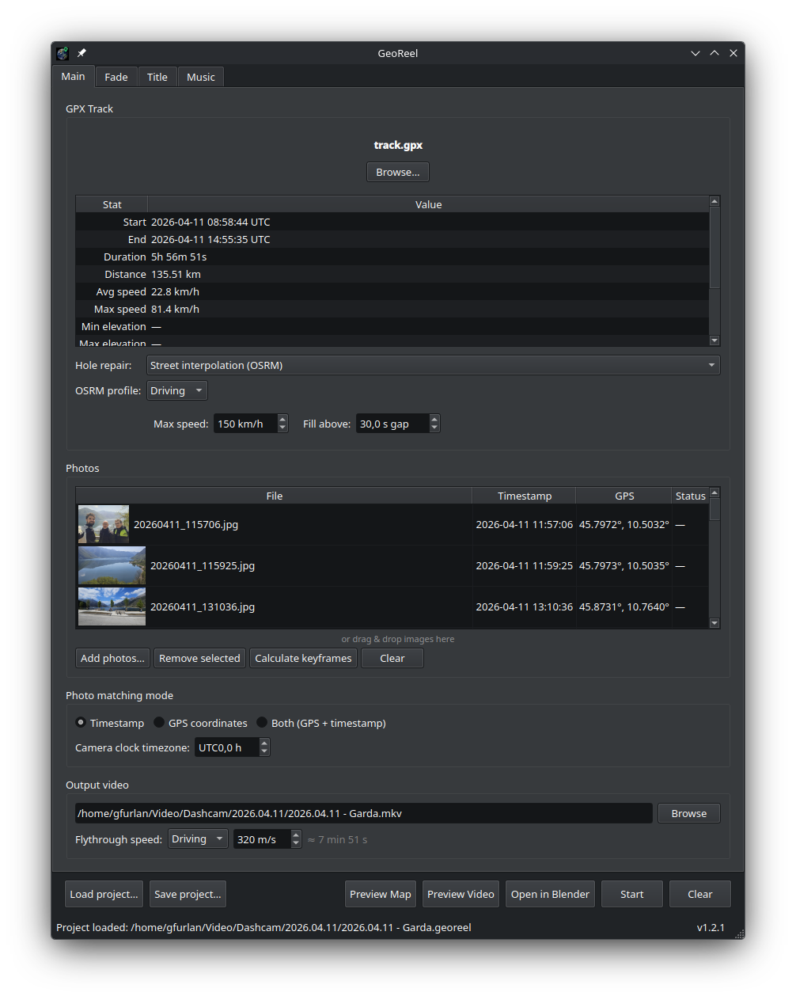
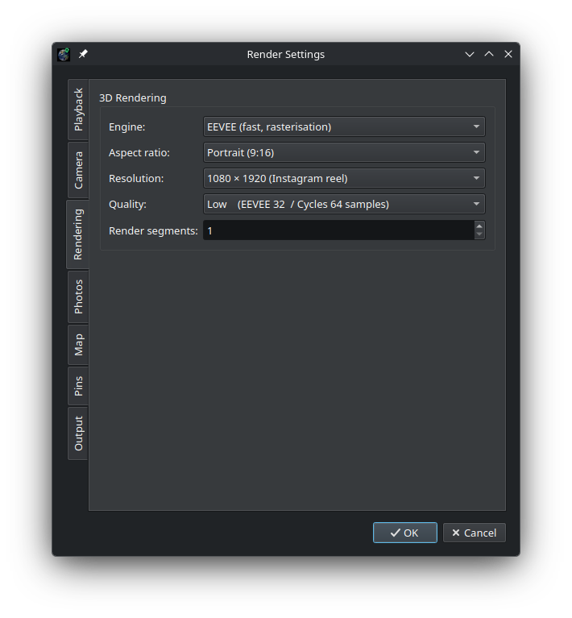

# GeoReel

[](https://github.com/elegos/georeel/actions/workflows/ci.yml)
[](https://github.com/elegos/georeel/releases/tag/v1.2.1)
[](https://codecov.io/github/elegos/georeel)

GeoReel is an open-source desktop application that turns a GPX track and a set of geotagged photos into a cinematic fly-through video of the route rendered on 3D terrain with satellite imagery — a self-hosted alternative to services like Relive.

Built with Python and Blender, it uses only open data sources (SRTM elevation, ESRI/MapTiler satellite tiles) and open-source tools, with no cloud dependency.

---

## Features

- **3D terrain rendering** from SRTM elevation data (90 m resolution), textured with real satellite imagery
- **Fly-through camera** that follows the GPX track with a configurable height, speed, tilt, and look-ahead
- **Photo waypoints** — geotagged photos are placed along the track and shown as full-screen overlays when the camera reaches their position
- **Flexible photo matching** — by GPS coordinates, by EXIF timestamp, or both
- **GPX hole repair** — fill recording gaps with linear interpolation or OSRM street-routed paths; a shifting-pin option highlights reconstructed segments visually
- **Ribbon coloring** — colour the track ribbon by terrain slope gradient or by GPS speed; a self-lit mode preserves full colour saturation in Blender's Filmic tone-mapper
- **Customisable rendering** — resolution (landscape, portrait, square), frame rate, engine (Viewport draft / EEVEE / Cycles), quality
- **Hardware encoder support** — NVIDIA NVENC, AMD AMF, Intel QSV, Apple VideoToolbox, and software fallbacks
- **Project files** — save and reload work as `.georeel` archives; DEM and satellite data are cached inside
- **Preview tools** — top-down map preview and short video preview before committing to a full render
- **Open in Blender** — inspect or manually edit the generated scene before rendering
---

## Screenshots




---

## Requirements

| Requirement | Version | Notes |
|---|---|---|
| [Python](https://www.python.org/downloads/) | 3.14+ | Required |
| [FFmpeg](https://ffmpeg.org/download.html) | Any recent | Must be on `PATH`; used for video encoding |
| [Blender](https://www.blender.org/download/) | 4.2 LTS, 4.4, or 4.5 LTS | Used for 3D rendering; can be auto-downloaded from inside GeoReel |

---

## Installation

See **[INSTALL.md](INSTALL.md)** for full instructions, including:

- Automated install scripts for Linux, macOS, and Windows
- Manual install from the release wheel (no `uv` needed)
- Build from source (requires [uv](https://docs.astral.sh/uv/))
- PySide6 system dependency details per Linux distribution

### Quick start

**Linux / macOS:**

```bash
curl -fsSL https://raw.githubusercontent.com/elegos/georeel/main/scripts/install.sh | bash
```

**Windows (PowerShell):**

```powershell
irm https://raw.githubusercontent.com/elegos/georeel/main/scripts/install.ps1 | iex
```

---

## Running

```bash
georeel
```

---

## Usage

### 1. Load a GPX track

Drag and drop a `.gpx` file onto the track area, or click to browse. The panel shows distance, elevation gain/loss, duration, and speed.

#### GPX hole repair (optional)

When a GPX track has gaps (recorder paused, satellite signal lost, implausible speed jumps), GeoReel can fill them with synthetic trackpoints. Select the repair mode from the **Repair** drop-down directly in the main window:

| Mode | Behaviour |
|---|---|
| **None** (default) | Gaps are left as-is; the camera jumps directly between the bounding valid points |
| **Linear** | Synthetic trackpoints are inserted along a straight line between the gap endpoints |
| **Street (OSRM)** | The OSRM routing API finds the shortest road route between the gap endpoints and resamples it uniformly; falls back silently to linear when OSRM is unavailable |

Enable **Shifting pin** to make the animated track marker alternate between its chosen colour and its complementary colour over any reconstructed (synthetic) segments, giving a clear visual indication that part of the track was repaired.

### 2. Add photos (optional)

Drag and drop geotagged photos onto the photo panel. GeoReel reads EXIF GPS coordinates and timestamps to place each photo at the correct position along the track.

**Matching mode** (set via *Options → Pipeline Settings → Photos*):

| Mode | Behaviour |
|---|---|
| GPS | Matches by geographic proximity to the nearest trackpoint |
| Timestamp | Matches by EXIF date/time against GPX timestamps |
| Both (default) | Uses GPS as primary; falls back to timestamp when GPS data is missing; warns if the two methods disagree by more than 100 m |

If your camera clock was set to a different timezone, adjust the offset under *Pipeline Settings → Playback*.

### 3. Configure pipeline settings

Open *Options → Pipeline Settings* to adjust:

- **Playback** — frame rate (24/30/60 fps)
- **Camera** — path smoothing, height above terrain, orientation (tangent or look-at), downward tilt, look-ahead, photo pause duration
- **Rendering** — engine (Viewport draft / EEVEE / Cycles), aspect ratio (landscape/portrait/square), resolution, quality, PNG compression, render segments
- **Photos** — transition style (fade or cut), letterbox fill (blurred or black), fade duration
- **Map** — satellite imagery provider and detail level
- **Pins** — colour of the track marker and photo waypoint pins
- **Output** — container (MKV/MP4), codec (H.264/H.265/AV1), encoder, quality (CQ/CRF), preset

See [docs/PIPELINE_SETTINGS.md](docs/PIPELINE_SETTINGS.md) for a full reference of all options.

#### Ribbon tab (main window)

The **Ribbon** tab in the main window controls per-project ribbon appearance and is saved inside the project file:

| Setting | Description |
|---|---|
| **Color — Slope** (default) | Ribbon is colour-coded by terrain gradient: cool colours for flat sections, warm colours for steep ascents/descents |
| **Color — Speed** | Ribbon is colour-coded by GPS speed across the 5th–95th percentile range of the track: blue for slow, cyan/green for mid-pace, orange for fast |
| **Self-lit** | Reduces the ribbon's emission strength so Blender's Filmic tone-mapper does not compress bright colours toward white — recommended when using the speed gradient or any vivid colour scheme |

> [!NOTE]
> If you run into **insufficient disk space** (the system `/tmp` partition fills up during processing), **GPU or system memory issues**, or **slow render performance**, see the [Troubleshooting: Performance and Memory](docs/PIPELINE_SETTINGS.md#troubleshooting-performance-and-memory) section of the Pipeline Settings reference. It covers how to redirect all temporary files to a different directory, how to reduce VRAM usage, and how to speed up rendering.

### 4. Preview

- **Preview Map** — renders a single top-down PNG of the terrain with the track and photo pins; fast and useful for checking photo placement
- **Preview Video** — renders the first 2 % of the video at reduced resolution so you can check the camera path and photo overlays before the full render
- **Open in Blender** — injects the camera path into the scene and opens Blender interactively; useful for inspecting the 3D scene or tweaking materials

### 5. Render

Click **Start** to run the full pipeline:

1. Parse GPX and match photos
2. Download SRTM elevation tiles
3. Fetch satellite imagery tiles
4. Build the 3D Blender scene (terrain mesh + texture + track ribbon + pins)
5. Compute the fly-through camera path
6. Render frames via Blender (EEVEE or Cycles)
7. Composite photo overlays using Pillow
8. Encode the final video with FFmpeg

Progress is shown frame-by-frame. You can cancel at any time.

### 6. Save/load projects

Use *File → Save Project* to write a `.georeel` file. It bundles the GPX path, photo references, elevation grid, satellite texture, and render settings so you can resume work later without re-downloading data.

---

## Satellite imagery providers

| Provider | Key required | Max zoom | Notes |
|---|---|---|---|
| ESRI World Imagery | No | 19 | Default |
| ESRI Clarity | No | 19 | Beta; higher detail in some regions |
| MapTiler Satellite | Yes (free tier) | 20 | Highest detail |
| Custom XYZ | — | — | Any `{z}/{x}/{y}` tile URL |

---

## Resolution presets

| Aspect ratio | Options |
|---|---|
| Landscape 16:9 | 1280×720, 1920×1080, 2560×1440, 3840×2160 |
| Portrait 9:16 | 720×1280, 1080×1920 (Instagram reel), 1440×2560, 2160×3840 |
| Square 1:1 | 720×720, 1080×1080, 1440×1440, 2160×2160 |

---

## Project structure

```
georeel/
├── main.py                        # Entry point
├── ui/                            # PySide6 GUI
│   ├── main_window.py
│   ├── render_settings_dialog.py
│   └── ...
├── core/                          # Pipeline stages
│   ├── gpx_parser.py              # Stage 1 — GPX parsing
│   ├── photo_matcher.py           # Stage 2 — Photo matching
│   ├── dem_fetcher.py             # Stage 3 — Elevation download
│   ├── satellite/                 # Stage 4 — Satellite imagery
│   ├── scene_builder.py           # Stage 5 — Blender scene
│   ├── camera_path.py             # Stage 6 — Camera keyframes
│   ├── frame_renderer.py          # Stage 7 — Frame rendering
│   ├── photo_compositor.py        # Stage 8 — Photo overlays
│   ├── video_assembler.py         # Stage 9 — FFmpeg encoding
│   └── blender_scripts/           # Scripts run inside Blender
│       ├── build_scene.py
│       ├── inject_camera.py
│       └── render_frames.py
└── assets/
    ├── icon.svg
    └── build_icon.py              # Embeds Earth photo into icon SVG
```

For a detailed breakdown of the pipeline and each component, see [docs/ARCHITECTURE.md](docs/ARCHITECTURE.md).

---

## License

GNU GPL v3.0
