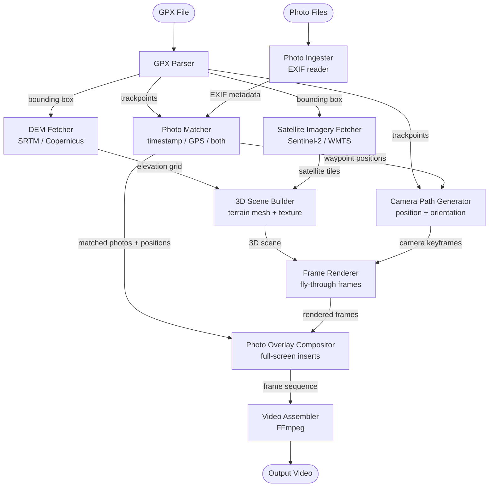

# GeoReel Architecture

## Pipeline Diagram

---

## Architectural Components

### 1. GPX Parser
Reads the input `.gpx` file and extracts the ordered list of trackpoints (latitude, longitude, elevation, timestamp). Also derives the bounding box used downstream for data fetching.

### 2. Photo Ingester
Reads all input photo files and extracts EXIF metadata: GPS coordinates (if present), capture timestamp, and image dimensions. Produces a normalised list of photo descriptors.

### 3. Photo Matcher
Resolves each photo to the nearest trackpoint using one of three strategies (controlled by `--photo-match`):
- **`timestamp`** — closest trackpoint by time delta
- **`gps`** — closest trackpoint by geographic distance
- **`both`** — GPS primary, timestamp fallback; warns when the two disagree beyond a configurable threshold

Outputs an ordered list of waypoints: `(trackpoint_index, photo_file)`.

### 4. DEM Fetcher
Downloads and caches a Digital Elevation Model (SRTM 30 m or Copernicus DEM) for the track bounding box. Exposes a regular elevation grid ready for mesh construction. Results are cached locally to avoid re-downloading.

### 5. Satellite Imagery Fetcher
Downloads and caches satellite image tiles (Sentinel-2, NASA Earthdata, or any open WMTS endpoint) covering the track bounding box at the required zoom level. Assembles tiles into a single georeferenced texture. Results are cached locally.

### 6. 3D Scene Builder
Combines the elevation grid and satellite texture into a 3D terrain scene. Responsible for mesh generation, UV mapping, and exporting the scene in a format consumable by the renderer.

### 7. Camera Path Generator
Computes a smooth fly-through camera trajectory following the GPX trackpoints. Determines position (slightly behind/above each point), look-at direction, and field of view. Inserts pause keyframes at photo waypoint positions to allow the compositor to insert photo overlays.

### 8. Frame Renderer
Renders each camera keyframe against the 3D scene, producing an image-per-frame sequence. Delegates to an open-source rendering backend (Blender, VTK, or similar).

### 9. Photo Overlay Compositor
At each photo waypoint, inserts the corresponding photo as a full-screen frame sequence (configurable duration, fade/cut transition). Merges these frames into the rendered frame sequence at the correct positions.

### 10. Video Assembler
Encodes the final ordered frame sequence (fly-through frames + photo overlays) into a video file using FFmpeg. Configurable codec, resolution, and frame rate.

---

## Data Flow Summary

| Stage | Input | Output |
|---|---|---|
| GPX Parser | `.gpx` file | trackpoints, bounding box |
| Photo Ingester | image files | EXIF metadata list |
| Photo Matcher | trackpoints + EXIF | waypoints `(index, photo)` |
| DEM Fetcher | bounding box | elevation grid |
| Satellite Imagery Fetcher | bounding box | georeferenced texture |
| 3D Scene Builder | elevation grid + texture | 3D scene |
| Camera Path Generator | trackpoints + waypoints | camera keyframes |
| Frame Renderer | 3D scene + keyframes | frame sequence |
| Photo Overlay Compositor | frames + matched photos | merged frame sequence |
| Video Assembler | merged frames | `.mp4` / output video |
