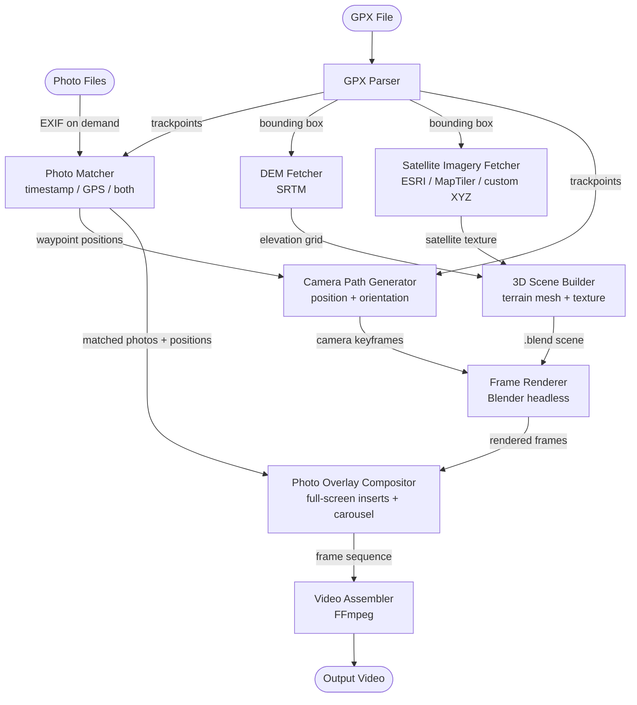

# GeoReel Architecture

## Pipeline Diagram

---

## Architectural Components

### 1. GPX Parser (`core/gpx_parser.py`)
Reads the input `.gpx` file and extracts the ordered list of trackpoints (latitude, longitude, elevation, timestamp). Also derives the bounding box used downstream for DEM and imagery fetching.

### 2. Photo Matcher (`core/photo_matcher.py`)
Reads EXIF metadata from photo files on demand (GPS coordinates, capture timestamp) and resolves each photo to its position along the track using one of three strategies:
- **`timestamp`** — closest trackpoint by time delta
- **`gps`** — closest trackpoint by geographic distance
- **`both`** (default) — GPS primary, timestamp fallback; warns when the two disagree beyond a configurable threshold

Photos that fall before or after the track time range are assigned a `pre` or `post` position and displayed as a slideshow before/after the fly-through. Outputs a list of `MatchResult` objects carrying `photo_path`, `trackpoint_index`, `position` (`pre`/`track`/`post`), and any warning or error.

### 3. DEM Fetcher (`core/dem_fetcher.py`)
Downloads SRTM elevation tiles (via the `srtm-py` library) for the expanded track bounding box. Tiles are cached locally (`~/.cache/srtm.py/`). Exposes a regular `ElevationGrid` (90 m resolution, float32, row-major) ready for mesh construction. Outlier cells and NoData voids are smoothed before the grid is handed to the scene builder.

### 4. Satellite Imagery Fetcher (`core/satellite/`)
Downloads XYZ/TMS tile imagery for the track bounding box at an automatically selected zoom level and stitches tiles into a single RGB texture. Supported providers:

| Provider | Key required |
|---|---|
| ESRI World Imagery (default) | No |
| ESRI Clarity | No |
| MapTiler Satellite | Yes (free tier) |
| Custom XYZ URL | — |

### 5. 3D Scene Builder (`core/scene_builder.py`)
Launches Blender headlessly and runs `blender_scripts/build_scene.py` to:
- Construct the terrain mesh from the elevation grid and apply the satellite texture
- Build the animated track ribbon (colour-coded by slope gradient or GPS speed, with an optional self-lit emission mode) with a Build modifier for progressive reveal
- Place the animated position marker and photo waypoint pins (billboard meshes with camera-facing constraints)
- Set up sun lighting using computed azimuth/elevation for the track's location and time

The resulting `.blend` file references the texture tiles as external PNG files and is stored in a temporary directory managed by `temp_manager`. Stale temporary directories from previous runs are detected and pruned on startup via `temp_manager.cleanup_stale()`; a custom base directory can be configured in *Pipeline Settings → Rendering*.

### 6. Camera Path Generator (`core/camera_path.py`)
Fits a parametric cubic B-spline through the trackpoints and resamples it at equal arc-length intervals (one sample per frame at the configured speed). Computes per-frame camera position (behind and above the track at a configurable slant distance and tilt), look-at direction (tangent or next-waypoint), and inserts pause keyframes at photo waypoint positions. Outputs a list of `CameraKeyframe` objects.

### 7. Frame Renderer (`core/frame_renderer.py`)
Launches Blender headlessly and runs `blender_scripts/render_frames.py`, which positions the camera at each keyframe and renders a PNG. Three render engines are supported:

- **Viewport (draft)** — EEVEE at 4 TAA samples, no shadow maps, no ambient occlusion, satellite textures downscaled to 50% resolution in VRAM before rendering. This is the primary performance lever for terrain scenes, which are texture-bandwidth-bound rather than compute-bound.
- **EEVEE** — full rasterisation at the configured quality level (32/64/128 samples).
- **Cycles** — physically-based path tracer at the configured quality level (64/128/256 samples), with automatic GPU detection.

When `render/n_segments > 1`, the render is split into N sequential Blender passes. Each pass loads only the terrain tiles whose world-space bounding boxes intersect the camera's AABB for that frame range, expanded by `render/frustum_margin_km`. This keeps per-pass VRAM proportional to the visible terrain fraction. Each Blender process exits completely between segments, fully releasing GPU memory before the next segment starts.

Output PNGs are stored in a temporary directory that is registered on `Pipeline._temp_dirs` for post-job cleanup.

### 8. Photo Overlay Compositor (`core/photo_compositor.py`)
Groups consecutive pause keyframes into blocks and renders them as a photo carousel:
- **Single photo at a waypoint**: fade in from terrain → full-screen photo → fade out to terrain
- **Multiple photos at the same waypoint**: terrain fade-in on the first, cross-fades between photos, terrain fade-out on the last
- Letterboxing: blurred photo fill or black bars, preserving aspect ratio
- Transition: fade (cross-dissolve) or cut (hard edit)

Supports all resolution presets (landscape 16:9, portrait 9:16, square 1:1). Output is stored in a temporary directory registered on `Pipeline._temp_dirs` for post-job cleanup.

### 9. Video Assembler (`core/video_assembler.py`)
Encodes the final frame sequence into a video file using FFmpeg. Configurable container (MKV/MP4), codec (H.264/H.265/AV1), and encoder with automatic detection of available hardware accelerators (NVIDIA NVENC, AMD AMF, Intel QSV, Apple VideoToolbox) and software fallbacks. For MKV output, the source GPX and render settings JSON are attached as named attachments.

---

## Data Flow Summary

| Stage | Input | Output |
|---|---|---|
| GPX Parser | `.gpx` file | trackpoints, bounding box |
| Photo Matcher | trackpoints + photo EXIF (on demand) | `list[MatchResult]` |
| DEM Fetcher | bounding box | `ElevationGrid` (90 m, float32) |
| Satellite Imagery Fetcher | bounding box | RGB texture (PNG) |
| 3D Scene Builder | elevation grid + texture + match results | `.blend` scene file |
| Camera Path Generator | trackpoints + match results | `list[CameraKeyframe]` |
| Frame Renderer | `.blend` scene + keyframes | PNG frame sequence |
| Photo Overlay Compositor | frames + match results + keyframes | merged PNG frame sequence |
| Video Assembler | merged frames | `.mp4` or `.mkv` |

---

## Temporary File Lifecycle

| Directory prefix | Contents | Cleanup |
|---|---|---|
| `georeel_scene_*` | DEM binary, texture PNG, `.blend` | `atexit` (on app exit) |
| `georeel_frames_*` | Blender-rendered PNGs | Immediately after stage 9 (or on cancel) |
| `georeel_comp_*` | Composited PNGs | Immediately after stage 9 (or on cancel) |
